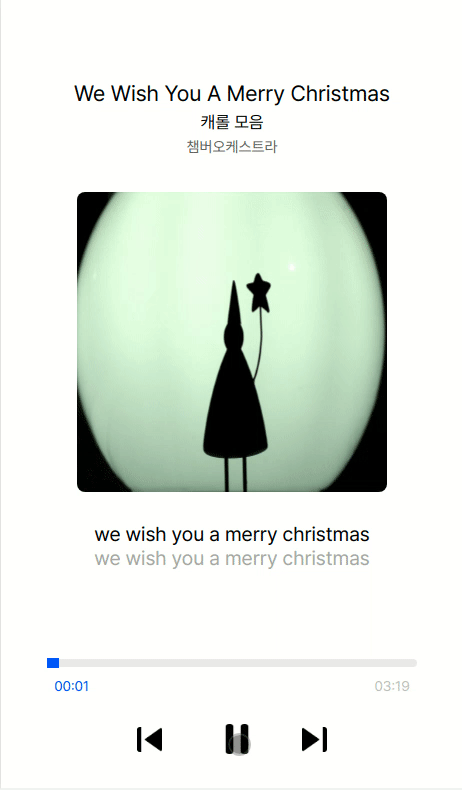

# 프로그래머스 뮤직 플레이어 앱 과제

[앱-ios] 과제를 React로 구현했습니다.

## 실행

env

```bash
VITE_MUSIC_API= 프로그래머스 참고
```

```bash
$ npm i
$ npm run dev
```

## 사용기술

|  |  |
| :-----------------------------------------------------------------------------------------------------------------------------: | :------------------------------------------------------------------------------------------------------------------------------------------------: |
|                                                              React                                                              |                                                                       Redux                                                                        |

## 화면 구성 요소

1. 음악 재생 화면
   - 재생 중인 음악 정보(제목, 가수, 앨범 커버 이미지, 앨범명)
   - 현재 재생 중인 부분의 가사 하이라이팅
   - Seekbar
   - Play/Stop 버튼
2. 전체 가사 보기 화면
   - 특정 가사로 이동할 수 있는 토글 버튼
   - 전체 가사 화면 닫기 버튼
   - Seekbar
   - Play/Stop 버튼
     <br/><br/><br/>


<br/><br/><br/>

## 고민했던 부분

- 가사 부분

  "["[03:20:56]메리크리스마스 개발은 재미있어요", ["03:20:56]오늘도 행복한 겨울&quot;]&quot;라는 형식의 데이터를 서버로부터 데이터를 받아오면 정규식을 사용해서 [03:20:56]와 같이 재생시간이 담긴 배열, &quot;메리 크리스마스 개발은 재미있어요&quot;라는 배열로 나눠서 Object Key value 값으로 각각 정의하고 Key에 맞는 value를 출력했습니다.

- 상태관리

  지금까지의 프로젝트는 부모 컴포넌트를 통해 자식으로 전달해 주는 상태 관리만 해왔고, 상태 관리 프레임워크를 사용해 본 적이 없습니다. 그 결과로 상태 전달이 많아질수록 코드가 복잡해지고 길어진다는 생각이 많이 들었습니다. 그렇기 때문에 이번에는 서버로부터 받아오는 데이터의 상태를 관리하고 음악 현재 시간을 전역 상태로 관리하기 위해 Redux를 사용했습니다.
